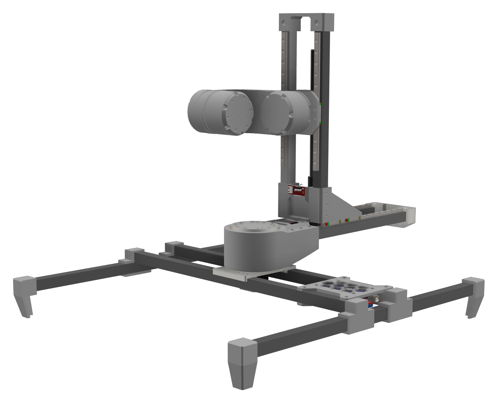
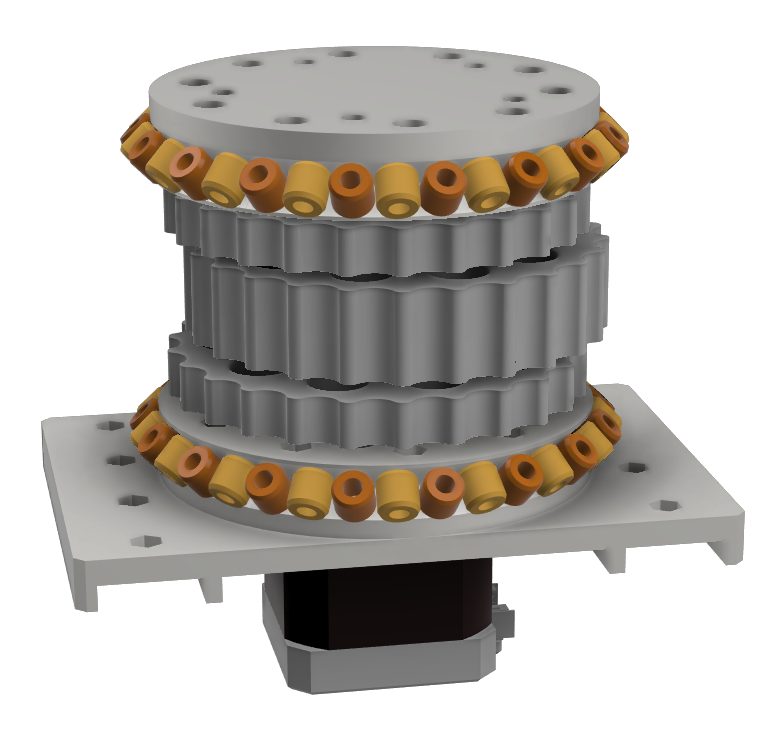

# 5-DOF Robotic Manipulator

This repository contains the research, design, and implementation of a compact 5-degree-of-freedom (DOF) robotic manipulator. The project focuses on the complete development lifecycle, from initial design and simulation to the physical implementation and control of the robotic arm, making it suitable for rapid prototyping, research, and light-duty material handling applications.

## Little bit about project:
The development of a 5-DOF robotic manipulator, designed for versatility and precision in a compact form factor. The project encompasses the mechanical design using 3D-printed components to keep the manufacturing cost of this as low as possible. The manipulator's performance is validated through extensive simulation and a physical prototype, demonstrating its capabilities in tasks such as pick-and-place operations and path following. The results establish it as a viable and accessible platform for academic research, educational purposes, and light-duty industrial automation.

## Key Specifications

| Specification      | Value                               |
| ------------------ | ----------------------------------- |
| **Degrees of Freedom** | 5                                   |
| **Reach**              | ~250mm                              |
| **Positional Accuracy**| ±1mm                                |
| **Frame Material**     | 3D Printed PLA/PETG                 |
| **Control System**     | Microcontroller-based               |

## Design
The design of the robot arm itself based on 5-axis movements, to have very high levels of movement and accuracy. So its have three rotary axis and 2 linear axis. The speciality about this robot from others was the whole robot rotate around the workspace, so whatever its working on stays still. The main idea was to keep everything compact. 

The base axis called `R_360-axis`  is the main axis that rotate around the main platform while carrying all other axis and it holds whole weight of the robot arm. To get a smoother movement and reduce the axis play a triple cycloidal disk gear system was used instead of dual cycloidal disk design. Crossed roller slewing bearings are used in this design to reduce any friction on output housing. 

`R-axis` is linear axis that can vary the radius of robot arm movements and that uses motor rotary movements and converted into linear movement by mean of a lead screw and nut. To grain accurate smooth movements with ability to accommodate heavy axial loads, linear guide rails ware used to drive this axis. `Z-Axis` is also a linear axis that same as the `R-axis` but in vertically. This design also used linear guide rails and lead screw setup to drive the joint. `J-Axis` joint don’t have too much load. so, these joint uses two cycloidal disks instead of three cycloidal disks that attached to eccentric shaft to drive the joint. To carry all radial loads, two ball bearings were used in each side of the output housing. This `I-Axis` joint work same as the `J-Axis` joint. In this design main housing back plate is used to mount this joint component to the `J-Axis` arm.

There is a good explanation how to [design cyclodial drive in SOLIDWORKS](https://www.makerslide-machines.com/wp-content/uploads/2017/03/Building-a-Cycloidal-Drive-with-SOLIDWORKS.pdf) with all equations and tools that used for designing. CAD files available in [cycloidal drive CAD folder](common/cyclodial_drive/)

## Configuration
A modified version of Merlin 3D printer firmware for rotating bed based printers,[Marlin 360 Firmware](https://github.com/kory75/Marlin_360) was used to run the robot. Marlin firmware is mainly configured to 3-aixs 3D printers, To work with 5-axis manipulator, there have to do some configuration and modification to the firmware, Specifically both extruders were configured to run two rotary axis on tool head. The marlin firmware for polar coordinates works mainly with `X` and `Y` coordinates. The `Z` coordinates that receive from the G-code (Geometric Code) works independently with the `Z` axis. But the `X` and `Y` coordinates that the marlin firmware gets from the G-code sender is a cartesian coordinate system that represented by `X` and `Y` value. In the polar coordinating system using `𝑅_360(𝑋_𝐴𝑋𝐼𝑆)` and `𝑅(𝑌_𝐴𝑋𝐼𝑆)` coordinating values to move the axis motors and use to represent the `X` and `Y` cartesian coordinates. `R_360(𝑋_𝐴𝑋𝐼𝑆)` and `𝑅(𝑌_𝐴𝑋𝐼𝑆)` values are calculated from the cartesian coordinates, from a Gcode if needed. From the centre point of the working table or the bed of the machine `(x_0, y_0)` have to move at an angle of $\alpha$ to and the tool head have to move a difference in the radial direction `R` the machine. from the current orientation to destination orientation, 

**The angle difference $\alpha$ can be get by,**\
$`\alpha=\arctan\left(\frac{\text{destination}[Y]}{\text{destination}[X]}\right)-\arctan\left(\frac{\text{current}_{\text{cartesian}}[Y]}{\text{current}_{\text{cartesian}}[X]}\right)`$

**Radial distance `x_diff` difference can get by,**\
$`x_{\text{diff}} =
\sqrt{\text{destination}[X]^2 + \text{destination}[Y]^2}-\sqrt{\text{current}_{\text{cartesian}\_position}[X]^2 + \text{current}_{\text{cartesian}\_position}[Y]^2}`$

**Updating the rotary systems's `X-axis` length,**\
$`R_{360}(X\_{\text{AXIS}}) = R_{360}(X\_{\text{AXIS}}) + x_{\text{diff}}`$

**Using outer radius to compute new `Y` position,**\
$`\text{new\_target\_y} =(R_{360\_\text{OUTER\_RADIUS}} \cdot \alpha)+r_{360}[Y\_{\text{AXIS}}]`$

**Also, steps per units were calculated as,**\
$`\text{DEFAULT\_AXIS\_STEPS\_PER\_UNIT}(Y_{\text{AXIS}})=\frac{R_{360\_\text{STEPS\_PER\_ROTATION}}}{y_{\text{length}}}`$

This steps per units for the `y-axis` have to be very precise otherwise the output will be not as expected. so the default settings on marlin firmware need to override by this. 

## Electronics
For simplicity the whole build was based on Arduino MEGA with RAMPS shield and ESP module (I had few extra laying around me that time, initial plan was to use STM32 with custom board). For first test runs A4988 and DRV8825 drives user to run Nema-17 motors. ESP module connected to Arduino MEGA in one of serial port. and ESP module used as Wifi-Serial Bridge with [ESP-LINK](https://github.com/jeelabs/esp-link) installed in ESP. So the most of the electronic parts were come from 3D printer parts. 

## Simulation testing
Simulation or sort of simulation(didn't go through simulations since already building the prototype and most of movements was checked withing CAD design) was done with Simulink (MATLAB). There is a plugin call [simascape multibody link](https://uk.mathworks.com/help/smlink/ref/linking-and-unlinking-simmechanics-link-software-with-solidworks.html) that allow to export Solidworks CAD assemply models to Simscape multibody in Simulink.

## Prototyping 
Most of the parts in the machine are done by 3D printing, considering the requirements such as strength, price and printerbility, PETG was a great choice. The hard part of printing or prototyping is the gear-drive parts, since those cycodial parts have tight tollarance had to pring over and over again to test best fit to archive zero play(or very close to) drive. Other than that its mostly fitting parts together with M3 nuts & bolts and bunch of heat inserts. 
On final design there were vibrations in botton drive specially when arm is too far away from the center, one of the issue with lack of support on that radial axis and other one is bottom drive's bearing were also 3D printed ones, so its not a smooth ride even with lubrications. 

## License
This publication is © 2022 [Prabath Ranathunga | ISSN 2961-502X].  
All rights reserved.  